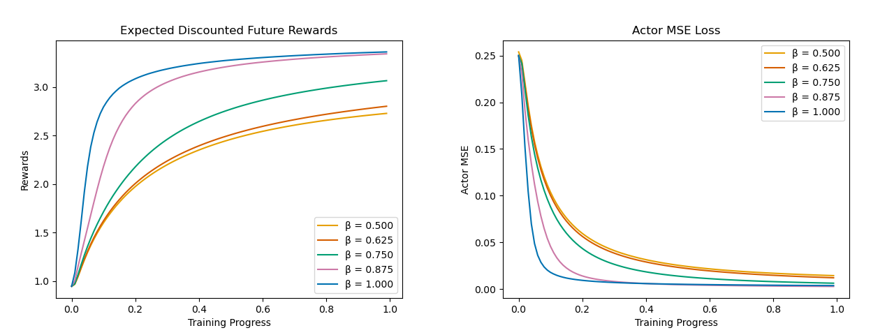

# Scaling Comparison Experiment for the Neural Actor-Critic Algorithm

[](https://opensource.org/licenses/Apache-2.0)
[](https://www.python.org/downloads/)

This repository contains the official JAX/Flax implementation for the paper **[Scaling Effects and Uncertainty Quantification in Neural Actor-Critic Algorithms](https://arxiv.org/abs/2601.17954)**. 

## Training Dynamics & Main Results

Below is the expected discounted future reward across 30 independent runs for varying network scaling parameter (β):



> **Note:** For a derivation of these figures, see the [`infer.ipynb`](infer.ipynb) notebook.

## Installation

1. **Clone the repository:**
   ```bash
   git clone [https://github.com/YOUR_USERNAME/jax-actor-critic.git](https://github.com/YOUR_USERNAME/jax-actor-critic.git)
   cd jax-actor-critic
   ```

2. **Install dependencies:**
   This installs the required packages (Flax, Optax, NumPy, etc.) and the **CPU-only** version of JAX.
   ```bash
   pip install -r requirements.txt
   ```

3. **Enable GPU Acceleration (Crucial for Cluster Use):**
   To utilize an NVIDIA GPU for XLA compilation, you must upgrade JAX to the CUDA-compatible version:
   ```bash
   pip install -U "jax[cuda12]"
   ```

## Usage

### 1. Training the Models
The main entry point is `run_experiments.py`. You can run it with the default hyperparameters or override them using command-line arguments:

```bash
python run_experiments.py --neurons 1000 --t 100 --runs 30 --alpha 25.0 --zeta 25.0 --beta 1.0
```

The script automatically tracks metrics across all runs and saves the aggregated data as `.npy` arrays in the root directory.

### 2. Evaluating the Results
Once training completes, you can automatically generate the evaluation plots (Rewards, Actor Loss, Critic Loss, etc.) by running the inference script:

```bash
python inference.py
```

This will read the generated `.npy` files, average the metrics across the parallel runs, and save high-resolution `.png` graphs to your folder.

## Project Structure

```text
actor-critic/
├── src/
│   ├── __init__.py
│   ├── mdp.py              # JAX-compatible PyTree MDP environment
│   ├── networks.py         # Flax Linen Actor and Critic architectures
│   └── algorithm.py        # Core XLA-compiled update steps
├── run_experiments.py      # CLI execution and training loop
├── infer.ipynb         # Evaluation, visualization, and metric tracking
├── requirements.txt        # Package dependencies
├── LICENSE                 # Apache License 2.0
└── README.md               # Project documentation
```

## 📄 License

This project is licensed under the Apache License 2.0 - see the [LICENSE](LICENSE) file for details.

## 📝 Citation

If you use this code in your research, please cite our paper:

```bibtex
@misc{georgoudios2026scalingeffectsuncertaintyquantification,
      title={Scaling Effects and Uncertainty Quantification in Neural Actor Critic Algorithms}, 
      author={Nikos Georgoudios and Konstantinos Spiliopoulos and Justin Sirignano},
      year={2026},
      eprint={2601.17954},
      archivePrefix={arXiv},
      primaryClass={cs.LG},
      url={https://arxiv.org/abs/2601.17954}, 
}
```
